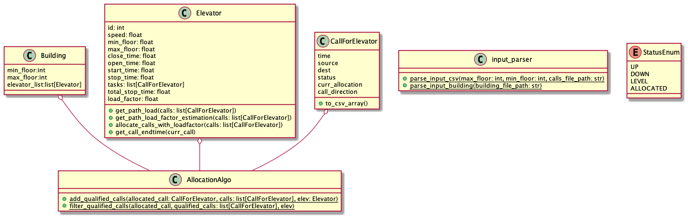

# oop-ex1

###**Detailed documentation can be found in the `pdf` file in this repo**

## Running the script

### Prerequisites
* Python 3.9.7
* no additional packages are used

The `main.py` script needs the following arguments to run:

1. `json` file that contains the building information
2. `csv` file that contains the calls that need to get allocated
3. **optional** `csv` file that will contain the calls that were allocated from the calls file the default output file
   is `out.csv`

example without the optional argument:

`python main.py Ex1_Buildings/B3.json Ex1_Calls/Calls_c.csv`

creates a csv file `out.csv` (default) with the allocation results

example with the optional argument:

`python main.py Ex1_Buildings/B3.json Ex1_Calls/Calls_c.csv B3C3.csv`

creates a csv file `B3C3.csv` (default) with the allocation results

running the output using the simulator given:

`java -jar Ex1_checker_V1.2_obf.jar 12,12 ./Ex1_Buildings/B4.json out.csv out.log`

##UML

## results

| Building | Calls File | average wait time per call | uncompleted calls |
|----------|------------|----------------------------|-------------------|
| B5.json  | Calls_b.csv  |   41.196                 |      0           |
| B5.json  | Calls_c.csv  |   41.674                 |      0           |
| B5.json  | Calls_a.csv  |   17.3                   |      0           |
| B5.json  | Calls_d.csv  |   41.518                 |      0           |
| B4.json  | Calls_b.csv  |   181.70649462399984     |      13          |
| B4.json  | Calls_c.csv  |   184.20176121999998     |      4           |
| B4.json  | Calls_a.csv  |   19.97                  |      0           |
| B4.json  | Calls_d.csv  |   195.238874732          |      2           |
| B3.json  | Calls_b.csv  |   530.2818701440002      |      128         |
| B3.json  | Calls_c.csv  |   537.0929335500026      |      110         |
| B3.json  | Calls_a.csv  |   30.71                  |      0           |
| B3.json  | Calls_d.csv  |   538.7732333840034      |      124         |
| B2.json  | Calls_a.csv  |   50.28                  |      0           |
| B1.json  | Calls_a.csv  |   112.92                 |      0           |